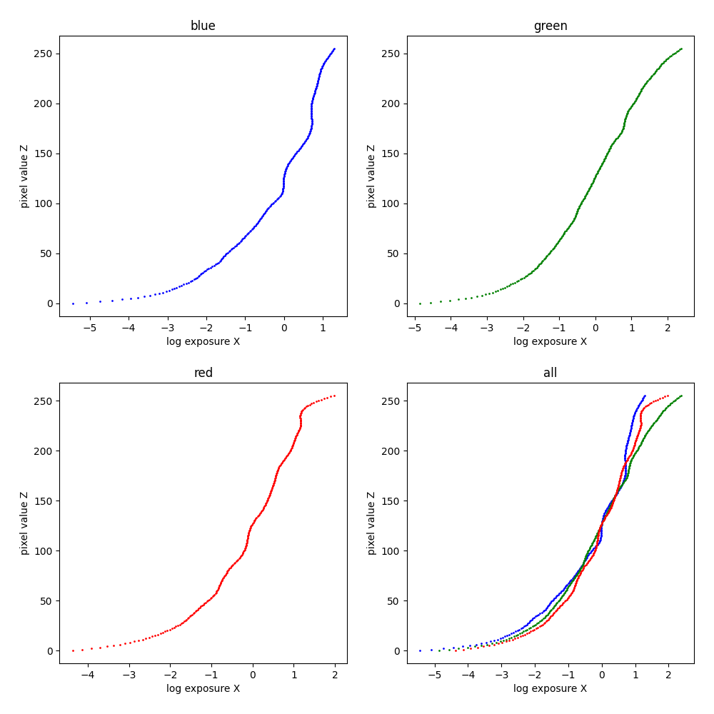

# High Dynamic Range Imaging
This project is an implementation of High Dynamic Range (HDR) imaging techniques.<br />
HDR imaging is a technique used to capture and display a wider range of brightness and color values than traditional imaging methods. 

## Usage
To run this project, you'll need to provide the input images and a txt file that records shutter speeds.
```
[input_directory]/
├──[image1]
├──[image2]
├──...
└──shutter_speed.txt
```
And then run
```
python3 hdr.py --src_dic [input_directory]
```

## Advanced Usage
```
python3 hdr.py --help
```

## Sample Results :church:
```
python3 hdr.py --no-mtb --src_dir memorial --out_dir memorial_outputs
```

Tone mapping
| Global tone mapping | Local tone mapping | 
| :-----------------: | :----------------: | 
|  |  |

Radiance map


Response curves


## Sample Results :classical_building:
Decompress CKS folder : `tar zxvf CKS.tar.gz`
```
python3 hdr.py --src_dir CKS --out_dir CKS_outputs
```

Tone mapping
| Global tone mapping | Local tone mapping | 
| :-----------------: | :----------------: | 
|  |  |

Radiance map


Response curves


